# 🏗️ Architecture Overview

## System Architecture

```mermaid
graph TB
    subgraph "Developer Workflow"
        DEV[👨‍💻 Developer] --> GIT[📝 Git Push]
        GIT --> GITHUB[🐙 GitHub Repository]
    end

    subgraph "CI/CD Pipeline"
        GITHUB --> ACTIONS[⚡ GitHub Actions]
        ACTIONS --> TERRAFORM[🏗️ Terraform]
        ACTIONS --> DOCKER[🐳 Docker Build]
        DOCKER --> ECR[📦 Amazon ECR]
    end

    subgraph "AWS Infrastructure"
        subgraph "Networking Layer"
            VPC[🌐 VPC 10.0.0.0/16]
            VPC --> PUB1[📡 Public Subnet 1<br/>10.0.1.0/24]
            VPC --> PUB2[📡 Public Subnet 2<br/>10.0.2.0/24]
            VPC --> PRIV1[🔒 Private Subnet 1<br/>10.0.101.0/24]
            VPC --> PRIV2[🔒 Private Subnet 2<br/>10.0.102.0/24]
            
            PUB1 --> NAT1[🌉 NAT Gateway 1]
            PUB2 --> NAT2[🌉 NAT Gateway 2]
            NAT1 --> PRIV1
            NAT2 --> PRIV2
            
            PUB1 --> IGW[🌍 Internet Gateway]
            PUB2 --> IGW
        end

        subgraph "Load Balancing"
            ALB[⚖️ Application Load Balancer]
            ALB --> TG[🎯 Target Group]
            CERT[🔐 SSL Certificate<br/>Self-Signed]
            ALB --> CERT
        end

        subgraph "Container Platform"
            ECS[🚢 ECS Cluster]
            ECS --> FARGATE[☁️ Fargate Service]
            FARGATE --> TASK1[📦 Task 1]
            FARGATE --> TASK2[📦 Task 2]
            ECR --> FARGATE
        end

        subgraph "Security & Secrets"
            SM[🔑 Secrets Manager]
            IAM[👤 IAM Roles]
            SG1[🛡️ ALB Security Group]
            SG2[🛡️ ECS Security Group]
        end

        subgraph "Monitoring"
            CW[📊 CloudWatch]
            LOGS[📝 CloudWatch Logs]
            ALARMS[🚨 CloudWatch Alarms]
        end

        subgraph "State Management"
            S3[🪣 S3 Bucket<br/>Terraform State]
        end
    end

    subgraph "External Access"
        USER[👤 End User] --> ALB
        ALB --> FARGATE
        FARGATE --> SM
        FARGATE --> LOGS
        CW --> ALARMS
    end

    TERRAFORM --> VPC
    TERRAFORM --> S3
    ACTIONS --> IAM
```



## Component Details

### 🌐 **Networking Architecture**
- **VPC**: Isolated network environment (10.0.0.0/16)
- **Public Subnets**: Host NAT Gateways and Load Balancer (2 AZs)
- **Private Subnets**: Host ECS Fargate tasks (2 AZs)
- **NAT Gateways**: Provide internet access for private subnets
- **Internet Gateway**: Public internet access

### ⚖️ **Load Balancing & SSL**
- **Application Load Balancer**: HTTPS termination and routing
- **Target Group**: Health checks and traffic distribution
- **SSL Certificate**: Self-signed certificate for HTTPS
- **HTTP → HTTPS Redirect**: Automatic security enforcement

### 🚢 **Container Platform**
- **ECS Cluster**: Managed container orchestration
- **Fargate Service**: Serverless container execution
- **Auto Scaling**: CPU/Memory based scaling
- **Health Checks**: Application and infrastructure monitoring

### 🔐 **Security Model**
- **IAM Roles**: Least privilege access control
- **Security Groups**: Network-level firewall rules
- **Secrets Manager**: Encrypted configuration storage
- **Private Subnets**: Application isolation

### 📊 **Monitoring & Observability**
- **CloudWatch Logs**: Centralized log aggregation
- **CloudWatch Alarms**: CPU and memory monitoring
- **Health Checks**: Application availability monitoring

## Data Flow

### 🔄 **Deployment Flow**


### 🌐 **Request Flow**


## Security Architecture

### 🛡️ **Network Security**
```
Internet → ALB (443/80) → ECS Tasks (3000)
                ↓
         Private Subnets Only
                ↓
         NAT Gateway → Internet (Outbound)
```

### 🔐 **Access Control**
- **GitHub Actions**: OIDC-based authentication
- **ECS Tasks**: IAM roles for AWS service access
- **Secrets**: Encrypted at rest and in transit
- **Network**: Security groups with minimal required access

### 🚨 **Monitoring Points**
- **Application Health**: ALB health checks
- **Resource Usage**: CPU/Memory alarms
- **Application Logs**: Structured logging to CloudWatch
- **Infrastructure**: Terraform state monitoring

## Cost Breakdown

| Component | Monthly Cost | Justification |
|-----------|-------------|---------------|
| **ECS Fargate** | $30-50 | 0.25 vCPU, 0.5GB RAM |
| **ALB** | $20 | HTTPS termination, health checks |
| **NAT Gateways (2x)** | $90 | High availability internet access |
| **Elastic IPs (2x)** | $7 | Static IPs for NAT Gateways |
| **Secrets Manager** | $1 | Encrypted configuration storage |
| **CloudWatch** | $2 | Logs and monitoring |
| **S3 State** | <$1 | Terraform state storage |
| **Total** | **~$150-170** | **Per month** |

## High Availability Design

### 🏗️ **Multi-AZ Deployment**
- **2 Availability Zones**: us-east-1a, us-east-1b
- **Redundant NAT Gateways**: One per AZ
- **Load Balancer**: Cross-AZ traffic distribution
- **ECS Service**: Tasks distributed across AZs

### 🔄 **Fault Tolerance**
- **Auto Scaling**: Replace unhealthy tasks
- **Health Checks**: Multiple layers of monitoring
- **Graceful Degradation**: Continue with reduced capacity
- **State Management**: Persistent Terraform state in S3

### 📈 **Scalability**
- **Horizontal**: Add more ECS tasks
- **Vertical**: Increase task CPU/memory
- **Auto Scaling**: Based on CPU/memory metrics
- **Load Balancing**: Distribute traffic evenly

## Deployment Strategies

### 🚀 **Rolling Deployment**
- **Zero Downtime**: New tasks start before old ones stop
- **Health Checks**: Ensure new tasks are healthy
- **Rollback**: Automatic on health check failures
- **Gradual**: Replace tasks one by one

### 🧪 **Testing Strategy**
- **Smoke Tests**: Basic functionality verification
- **Health Checks**: Application and infrastructure
- **Integration Tests**: End-to-end request flow
- **Monitoring**: Real-time metrics during deployment

## Disaster Recovery

### 💾 **Backup Strategy**
- **Terraform State**: Versioned in S3
- **Container Images**: Stored in ECR
- **Configuration**: Encrypted in Secrets Manager
- **Infrastructure**: Reproducible via Terraform

### 🔄 **Recovery Procedures**
1. **State Recovery**: Restore from S3 versions
2. **Infrastructure**: Re-deploy via Terraform
3. **Application**: Deploy from ECR images
4. **Configuration**: Restore from Secrets Manager

### ⏱️ **Recovery Objectives**
- **RTO (Recovery Time)**: ~15 minutes
- **RPO (Recovery Point)**: Near real-time
- **Automation**: Fully automated via workflows
- **Testing**: Regular disaster recovery drills
