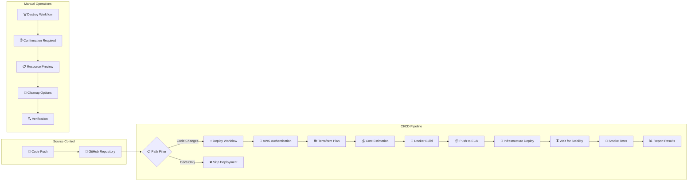
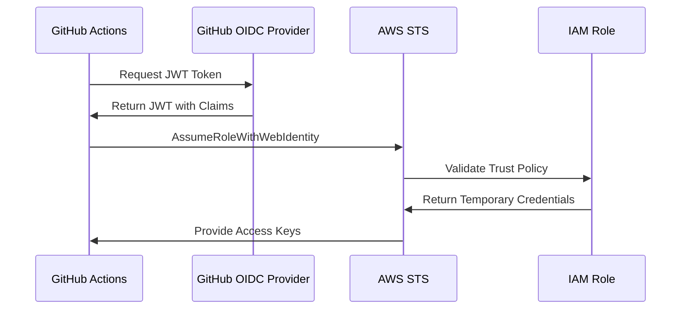

# 🔄 CI/CD Pipeline Guide

## Pipeline Overview



## Workflow Triggers

### 🚀 **Deploy Workflow**
**Automatic Triggers:**
- Push to `main` branch (code changes only)
- Excludes: `README.md`, `docs/**`, `*.md`, `.gitignore`, `LICENSE`

**Manual Trigger:**
- Workflow dispatch with cost estimation option

**Files that trigger deployment:**
```
✅ app/                 # Application code
✅ infra/               # Terraform configuration  
✅ .github/workflows/   # Workflow changes
✅ Dockerfile           # Container configuration
✅ setup.sh             # Setup scripts
❌ README.md            # Documentation
❌ docs/                # Documentation folder
❌ *.md                 # Markdown files
```

### 🗑️ **Destroy Workflow**
**Manual Only:**
- Requires typing "DESTROY" to confirm
- Options for preserving core resources
- Force cleanup for stuck resources

## Pipeline Stages

### 1️⃣ **Source & Authentication**
```yaml
- name: 📥 Checkout
  uses: actions/checkout@v4

- name: 🔐 Configure AWS credentials
  uses: aws-actions/configure-aws-credentials@v4
  with:
    role-to-assume: ${{ secrets.AWS_ROLE_TO_ASSUME }}
    aws-region: us-east-1
```

**What happens:**
- Code checkout from repository
- OIDC authentication with AWS
- Assume GitHub Actions IAM role

### 2️⃣ **Infrastructure Planning**
```yaml
- name: 🔄 Terraform Init
- name: 📋 Terraform Plan
- name: 💰 Cost Estimate
```

**What happens:**
- Initialize Terraform with S3 backend
- Generate execution plan
- Display resource changes and cost estimates
- Extract metrics for reporting

### 3️⃣ **Container Build**
```yaml
- name: 🐳 Login to ECR
- name: 🔨 Build and Push Docker Image
```

**What happens:**
- Authenticate with Amazon ECR
- Build Docker image with commit SHA tag
- Push to ECR repository
- Tag for deployment

### 4️⃣ **Infrastructure Deployment**
```yaml
- name: 🚀 Deploy Infrastructure
- name: ⏳ Wait for Service Deployment
```

**What happens:**
- Apply Terraform configuration
- Create/update AWS resources
- Wait for ECS service stabilization
- Ensure all resources are healthy

### 5️⃣ **Testing & Validation**
```yaml
- name: 🌐 Get Application URL
- name: 🧪 Smoke Tests
```

**What happens:**
- Extract application URLs from Terraform outputs
- Test HTTP → HTTPS redirect
- Verify application functionality
- Validate database connection

### 6️⃣ **Reporting**
```yaml
- name: 📊 Deployment Summary
```

**What happens:**
- Generate deployment summary
- Report resource counts and status
- Display application URLs
- Show test results

## Security Model

### 🔐 **Authentication Flow**


### 🛡️ **IAM Role Configuration**
```json
{
  "Version": "2012-10-17",
  "Statement": [
    {
      "Effect": "Allow",
      "Principal": {
        "Federated": "arn:aws:iam::ACCOUNT:oidc-provider/token.actions.githubusercontent.com"
      },
      "Action": "sts:AssumeRoleWithWebIdentity",
      "Condition": {
        "StringEquals": {
          "token.actions.githubusercontent.com:aud": "sts.amazonaws.com"
        },
        "StringLike": {
          "token.actions.githubusercontent.com:sub": "repo:USER/REPO:*"
        }
      }
    }
  ]
}
```

### 🔑 **Secrets Management**
- **GitHub Secrets**: `AWS_ROLE_TO_ASSUME` (IAM Role ARN)
- **AWS Secrets Manager**: Database connection strings
- **No Hardcoded Secrets**: All sensitive data encrypted

## State Management

### 🪣 **Terraform State**
```
S3 Bucket: hello-fargate-terraform-state
├── terraform.tfstate (current)
├── versions/ (historical)
└── locks/ (state locking)
```

**Features:**
- **Versioning**: Enabled for rollback capability
- **Encryption**: Server-side encryption at rest
- **Locking**: Prevents concurrent modifications
- **Backup**: Automatic versioning and retention

### 🔄 **State Lifecycle**
1. **Initialize**: `terraform init` connects to S3 backend
2. **Plan**: Read current state, compare with desired
3. **Apply**: Update state with changes
4. **Lock**: Prevent concurrent modifications
5. **Backup**: Automatic versioning on changes

## Error Handling

### 🚨 **Common Failure Scenarios**

#### **Authentication Failures**
```bash
Error: Assuming role with OIDC
```
**Solutions:**
- Verify `AWS_ROLE_TO_ASSUME` secret
- Check IAM role trust policy
- Ensure repository matches trust policy

#### **Resource Conflicts**
```bash
Error: Resource already exists
```
**Solutions:**
- Run `./setup.sh` to import existing resources
- Use destroy workflow with preserve option
- Manual resource import via Terraform

#### **State Lock Issues**
```bash
Error: Error acquiring the state lock
```
**Solutions:**
- Wait for concurrent operation to complete
- Force unlock if process crashed: `terraform force-unlock`
- Check S3 bucket permissions

#### **Deployment Timeouts**
```bash
Error: ECS service failed to stabilize
```
**Solutions:**
- Check ECS service events in AWS console
- Review CloudWatch logs for application errors
- Verify security group and networking configuration

### 🔧 **Troubleshooting Commands**
```bash
# Check ECS service status
aws ecs describe-services --cluster hello-fargate --services hello-fargate

# View application logs
aws logs tail /ecs/hello-fargate --follow

# Check ALB health
aws elbv2 describe-target-health --target-group-arn <TARGET_GROUP_ARN>

# Terraform state inspection
terraform state list
terraform state show <RESOURCE>
```

## Performance Optimization

### ⚡ **Pipeline Speed**
- **Parallel Execution**: Independent steps run concurrently
- **Caching**: Docker layer caching in ECR
- **Incremental**: Only changed resources updated
- **Skip Logic**: Documentation changes don't trigger deployment

### 📊 **Resource Optimization**
- **Right-sizing**: Appropriate CPU/memory allocation
- **Auto Scaling**: Scale based on demand
- **Cost Monitoring**: Regular cost analysis
- **Resource Cleanup**: Automatic cleanup of unused resources

## Monitoring & Alerting

### 📈 **Pipeline Metrics**
- **Success Rate**: Deployment success percentage
- **Duration**: Average deployment time
- **Failure Points**: Common failure locations
- **Resource Drift**: Infrastructure changes outside Terraform

### 🚨 **Alerting Strategy**
- **Deployment Failures**: Immediate notification
- **Resource Alarms**: CPU/Memory thresholds
- **Cost Alerts**: Budget threshold notifications
- **Security Events**: Unauthorized access attempts

## Best Practices

### ✅ **Development Workflow**
1. **Feature Branches**: Develop in separate branches
2. **Pull Requests**: Code review before merge
3. **Testing**: Local testing before push
4. **Documentation**: Update docs with code changes

### 🔒 **Security Practices**
1. **Least Privilege**: Minimal required permissions
2. **Secret Rotation**: Regular credential updates
3. **Audit Logging**: Track all infrastructure changes
4. **Compliance**: Follow security best practices

### 🏗️ **Infrastructure Practices**
1. **Infrastructure as Code**: All changes via Terraform
2. **Version Control**: Track all configuration changes
3. **Environment Parity**: Consistent across environments
4. **Disaster Recovery**: Regular backup and recovery testing

## Scaling Considerations

### 📈 **Horizontal Scaling**
- **ECS Service**: Increase desired task count
- **Auto Scaling**: CPU/memory based scaling
- **Load Balancer**: Distribute across multiple tasks
- **Database**: Consider RDS for production workloads

### 🔄 **Multi-Environment**
- **Environment Separation**: Dev, staging, production
- **Terraform Workspaces**: Separate state per environment
- **Configuration Management**: Environment-specific variables
- **Promotion Pipeline**: Automated environment promotion

### 🌍 **Multi-Region**
- **Cross-Region Replication**: Disaster recovery
- **Global Load Balancing**: Route 53 health checks
- **Data Synchronization**: Cross-region data replication
- **Compliance**: Regional data residency requirements
