# 🛠️ Tooling & Operations Guide

## Tool Stack Overview

```mermaid
graph TB
    subgraph "Development Tools"
        GIT[📝 Git] --> GITHUB[🐙 GitHub]
        VS[💻 VS Code] --> DOCKER[🐳 Docker]
        NODE[🟢 Node.js] --> NPM[📦 npm]
    end

    subgraph "Infrastructure Tools"
        TF[🏗️ Terraform] --> AWS[☁️ AWS CLI]
        GITHUB --> GA[⚡ GitHub Actions]
        TF --> S3[🪣 S3 Backend]
    end

    subgraph "Monitoring Tools"
        CW[📊 CloudWatch] --> LOGS[📝 Logs]
        CW --> METRICS[📈 Metrics]
        CW --> ALARMS[🚨 Alarms]
    end

    subgraph "Security Tools"
        IAM[👤 IAM] --> OIDC[🔐 OIDC]
        SM[🔑 Secrets Manager] --> ENCRYPT[🔒 Encryption]
    end
```



## Required Tools

### 🖥️ **Local Development**
| Tool | Version | Purpose | Installation |
|------|---------|---------|-------------|
| **Git** | Latest | Version control | `brew install git` |
| **AWS CLI** | v2+ | AWS management | `brew install awscli` |
| **Terraform** | 1.5+ | Infrastructure as Code | `brew install terraform` |
| **Docker** | Latest | Container development | `brew install docker` |
| **Node.js** | 18+ | Application runtime | `brew install node` |
| **jq** | Latest | JSON processing | `brew install jq` |

### ☁️ **Cloud Services**
| Service | Purpose | Configuration |
|---------|---------|---------------|
| **GitHub** | Source control & CI/CD | Repository with Actions enabled |
| **AWS Account** | Cloud infrastructure | Programmatic access configured |
| **ECR** | Container registry | Repository: `hello-fargate` |
| **S3** | State storage | Bucket: `hello-fargate-terraform-state` |

## Setup Instructions

### 1️⃣ **Initial Setup**
```bash
# Clone repository
git clone https://github.com/YOUR_USERNAME/simple-webservice-to-AWS.git
cd simple-webservice-to-AWS

# Run automated setup
./setup.sh
```

### 2️⃣ **AWS Configuration**
```bash
# Configure AWS CLI
aws configure
# AWS Access Key ID: [Your Access Key]
# AWS Secret Access Key: [Your Secret Key]
# Default region name: us-east-1
# Default output format: json

# Verify configuration
aws sts get-caller-identity
```

### 3️⃣ **GitHub Configuration**
1. Fork/clone the repository
2. Go to Settings → Secrets and variables → Actions
3. Add repository secret:
   - **Name**: `AWS_ROLE_TO_ASSUME`
   - **Value**: `arn:aws:iam::YOUR_ACCOUNT:role/github-actions-role`

## Operational Commands

### 🏗️ **Infrastructure Management**

#### **Deploy Infrastructure**
```bash
# Manual deployment
cd infra
terraform init
terraform plan
terraform apply

# Via GitHub Actions
git push origin main
# or trigger manually in GitHub Actions UI
```

#### **Check Infrastructure Status**
```bash
# Terraform state
terraform state list
terraform show

# AWS resources
aws ecs describe-clusters --clusters hello-fargate
aws elbv2 describe-load-balancers --names hello-fargate-alb
aws ec2 describe-vpcs --filters "Name=tag:Name,Values=hello-fargate-vpc"
```

#### **Destroy Infrastructure**
```bash
# Via GitHub Actions (Recommended)
# Go to Actions → "Destroy Infrastructure" → Run workflow

# Manual destruction
cd infra
terraform destroy

# Complete cleanup
./cleanup.sh
```

### 🐳 **Container Management**

#### **Local Development**
```bash
# Build locally
docker build -t hello-fargate .

# Run locally
docker run -p 3000:3000 hello-fargate

# Test locally
curl http://localhost:3000
```

#### **ECR Operations**
```bash
# Login to ECR
aws ecr get-login-password --region us-east-1 | docker login --username AWS --password-stdin YOUR_ACCOUNT.dkr.ecr.us-east-1.amazonaws.com

# List images
aws ecr describe-images --repository-name hello-fargate

# Delete old images
aws ecr batch-delete-image --repository-name hello-fargate --image-ids imageTag=old-tag
```

### 📊 **Monitoring & Debugging**

#### **Application Logs**
```bash
# Stream logs
aws logs tail /ecs/hello-fargate --follow

# Get specific time range
aws logs filter-log-events --log-group-name /ecs/hello-fargate --start-time 1640995200000

# Search logs
aws logs filter-log-events --log-group-name /ecs/hello-fargate --filter-pattern "ERROR"
```

#### **ECS Service Management**
```bash
# Service status
aws ecs describe-services --cluster hello-fargate --services hello-fargate

# Task details
aws ecs list-tasks --cluster hello-fargate --service-name hello-fargate
aws ecs describe-tasks --cluster hello-fargate --tasks TASK_ARN

# Service events
aws ecs describe-services --cluster hello-fargate --services hello-fargate --query 'services[0].events'
```

#### **Load Balancer Health**
```bash
# Target group health
aws elbv2 describe-target-health --target-group-arn TARGET_GROUP_ARN

# Load balancer status
aws elbv2 describe-load-balancers --names hello-fargate-alb
```

### 🔐 **Security Management**

#### **IAM Role Management**
```bash
# Check role
aws iam get-role --role-name github-actions-role

# List attached policies
aws iam list-attached-role-policies --role-name github-actions-role

# Update trust policy
aws iam update-assume-role-policy --role-name github-actions-role --policy-document file://trust-policy.json
```

#### **Secrets Management**
```bash
# Get secret value
aws secretsmanager get-secret-value --secret-id hello-fargate-db-connection

# Update secret
aws secretsmanager put-secret-value --secret-id hello-fargate-db-connection --secret-string "new-value"

# List secrets
aws secretsmanager list-secrets --query 'SecretList[?contains(Name, `hello-fargate`)]'
```

## Troubleshooting Guide

### 🚨 **Common Issues**

#### **Deployment Failures**
```bash
# Issue: Terraform state lock
Error: Error acquiring the state lock

# Solution: Force unlock (use carefully)
terraform force-unlock LOCK_ID

# Issue: Resource already exists
Error: Resource already exists

# Solution: Import existing resource
terraform import aws_resource.name resource-id
```

#### **Application Issues**
```bash
# Issue: ECS tasks not starting
# Check: Task definition, security groups, subnets

# Debug commands:
aws ecs describe-tasks --cluster hello-fargate --tasks TASK_ARN
aws logs tail /ecs/hello-fargate --follow

# Issue: Load balancer health checks failing
# Check: Security groups, target group configuration

# Debug commands:
aws elbv2 describe-target-health --target-group-arn TG_ARN
curl -v http://ALB_DNS_NAME/
```

#### **Network Issues**
```bash
# Issue: Cannot reach application
# Check: Security groups, NACLs, routing

# Debug commands:
aws ec2 describe-security-groups --group-ids sg-xxx
aws ec2 describe-route-tables --filters "Name=vpc-id,Values=vpc-xxx"
aws ec2 describe-nat-gateways --filter "Name=vpc-id,Values=vpc-xxx"
```

### 🔧 **Diagnostic Scripts**

#### **Health Check Script**
```bash
#!/bin/bash
# health-check.sh

echo "🔍 Infrastructure Health Check"
echo "=============================="

# Check ECS service
ECS_STATUS=$(aws ecs describe-services --cluster hello-fargate --services hello-fargate --query 'services[0].status' --output text 2>/dev/null || echo "NOT_FOUND")
echo "ECS Service: $ECS_STATUS"

# Check ALB
ALB_STATUS=$(aws elbv2 describe-load-balancers --names hello-fargate-alb --query 'LoadBalancers[0].State.Code' --output text 2>/dev/null || echo "NOT_FOUND")
echo "Load Balancer: $ALB_STATUS"

# Check application
ALB_DNS=$(aws elbv2 describe-load-balancers --names hello-fargate-alb --query 'LoadBalancers[0].DNSName' --output text 2>/dev/null)
if [ "$ALB_DNS" != "None" ] && [ ! -z "$ALB_DNS" ]; then
    HTTP_STATUS=$(curl -s -o /dev/null -w "%{http_code}" http://$ALB_DNS/ || echo "000")
    echo "HTTP Status: $HTTP_STATUS"
    
    APP_RESPONSE=$(curl -k -s https://$ALB_DNS/ | jq -r '.message' 2>/dev/null || echo "ERROR")
    echo "App Response: $APP_RESPONSE"
fi
```

#### **Cost Analysis Script**
```bash
#!/bin/bash
# cost-analysis.sh

echo "💰 Cost Analysis"
echo "================"

# Get current month costs
aws ce get-cost-and-usage \
    --time-period Start=2024-01-01,End=2024-01-31 \
    --granularity MONTHLY \
    --metrics BlendedCost \
    --group-by Type=DIMENSION,Key=SERVICE \
    --query 'ResultsByTime[0].Groups[?Keys[0]==`Amazon Elastic Container Service` || Keys[0]==`Amazon Elastic Load Balancing` || Keys[0]==`Amazon Virtual Private Cloud`]'
```

## Performance Optimization

### ⚡ **Application Performance**
```bash
# Monitor CPU/Memory usage
aws cloudwatch get-metric-statistics \
    --namespace AWS/ECS \
    --metric-name CPUUtilization \
    --dimensions Name=ServiceName,Value=hello-fargate Name=ClusterName,Value=hello-fargate \
    --start-time 2024-01-01T00:00:00Z \
    --end-time 2024-01-01T23:59:59Z \
    --period 3600 \
    --statistics Average

# Scale service
aws ecs update-service \
    --cluster hello-fargate \
    --service hello-fargate \
    --desired-count 3
```

### 🏗️ **Infrastructure Optimization**
```bash
# Right-size resources
# Update task definition with appropriate CPU/memory

# Optimize costs
# Consider single NAT Gateway for non-production
# Use Spot instances for development environments
# Schedule scaling for predictable workloads
```

## Backup & Recovery

### 💾 **Backup Procedures**
```bash
# Backup Terraform state
aws s3 cp s3://hello-fargate-terraform-state/terraform.tfstate ./backup/

# Export configuration
terraform show -json > infrastructure-backup.json

# Backup secrets
aws secretsmanager get-secret-value --secret-id hello-fargate-db-connection > secrets-backup.json
```

### 🔄 **Recovery Procedures**
```bash
# Restore from backup
aws s3 cp ./backup/terraform.tfstate s3://hello-fargate-terraform-state/

# Re-deploy infrastructure
terraform init
terraform plan
terraform apply

# Verify recovery
./health-check.sh
```

## Automation Scripts

### 🤖 **Useful Automation**
```bash
# Auto-cleanup old ECR images
#!/bin/bash
aws ecr list-images --repository-name hello-fargate --filter tagStatus=UNTAGGED --query 'imageIds[?imageDigest!=null]' --output json | jq '.[] | select(.imagePushedAt < (now - 86400*7))' | aws ecr batch-delete-image --repository-name hello-fargate --image-ids file:///dev/stdin

# Auto-scale based on time
#!/bin/bash
HOUR=$(date +%H)
if [ $HOUR -ge 9 ] && [ $HOUR -le 17 ]; then
    DESIRED_COUNT=2  # Business hours
else
    DESIRED_COUNT=1  # Off hours
fi
aws ecs update-service --cluster hello-fargate --service hello-fargate --desired-count $DESIRED_COUNT
```

## Best Practices

### ✅ **Operational Excellence**
1. **Monitoring**: Set up comprehensive monitoring and alerting
2. **Documentation**: Keep runbooks and procedures updated
3. **Testing**: Regular disaster recovery testing
4. **Automation**: Automate repetitive tasks
5. **Security**: Regular security audits and updates

### 📊 **Performance Management**
1. **Metrics**: Track key performance indicators
2. **Optimization**: Regular performance tuning
3. **Capacity Planning**: Monitor growth trends
4. **Cost Management**: Regular cost optimization reviews

### 🔒 **Security Operations**
1. **Access Control**: Regular access reviews
2. **Vulnerability Management**: Keep systems updated
3. **Incident Response**: Defined procedures for security incidents
4. **Compliance**: Regular compliance audits
